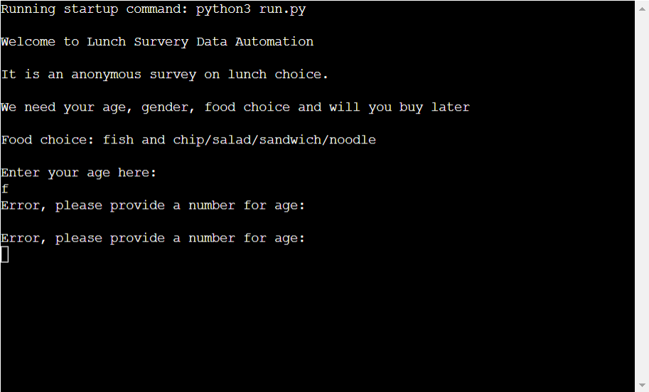
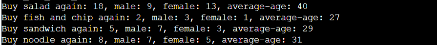

<h1>Lunch Survey</h1>

[Lunch Survey](https://lunch-survey.herokuapp.com/)
 is a Python survey database system that enable user to input their lunch choice with their ages, gender, lunch choice, and willingness to buy again.

The aim of this survey project is to collect and analyse the relationship between the food choice and different age groups, gender. In order to provide sales data for supermarket in maximizing sales in lunch hours.

<h1>How it works?</h1>

The survey can be structured into three main parts: Survey Input, Update Worksheet, and Survey Result.

<h2>Survey Input</h2>

<ul>

<li>Users will be requested to input their age, gender, food choice (sandwich, fish and chip, noodle and salad) and willing to buy again (yes or no). </li>

<li>If user input answer that does not match the required options, it will print out Error message and request user to reenter.</li>

<li>The result will be printed out for user reference.</li> 

<li>The result will be reorganised into a list format by append method. </li>

</ul>

<h2>Update Worksheet</h2>

<ul>

<li>After receiving user input and validated the data type is correct, they will be updated to the google worksheet named "sales" </li>

<li> It will append the list when user finish inputting</li>

<li> It will print out a statement saying the worksheet is successfully updated.</li>

<li> As each product also has their own worksheet, they will have a separate update function for updating the list data if the food choice matches the required choice for categorisation.</li>

</ul>

<h2>Survey Result</h2>

<ul>

<li>This function would collect data from the food choice spreadsheet (e.g."salad_sales" for salad).

<li>This function would loop through the data to screen out the number of male and female in the data list and the number of people who say yes to buy again.</li>

<li>This function will also get the age value from the google spreadsheet and canculate it to produce the mean of users' age within the food choice spreadsheet.</li>

<li>This function would also print the result out to show the result to the user.</li>

</ul>

<h1>Flowchart</h1>

<h1>Feature</h1>

<ul>
<li>Printing out the users' choice after they have entered</li>

<li>Break the function if users' answers do not match the required options</li>

<li>Print out average age, male and female, and number of people buy again with each food choice.</li>

<li>Ask if user wants to resubmit, if no, the programme ends with a Thank you statement printed</li>

</ul>

<h1>Testing</h1>

<h2>I have manually tested the project by doing the following:</h2>
<ul>
<li>The code passed the PEP8 linter and confirm no problem.</li>
<li>Use a while loop to ask user to enter again when having invalid data.</li>
<li>code tested in my local terminal and code Institue Heroku terminal.</li>
</ul>

<h1>Bugs</h1>

<ul>
<li>When I try to set the validate function in the project, I have set a separate validate_input function, but it cannot break the user from continuing if they provide wrong input. I solved it after discussing with mentor and adding while loop in survey_input()</li>
<li>I also cannot import some data when running the survey because the food choice is uppercase, I added lower.() to avoid this happen again.</li>
<li>When I calculate the average_age, I forget to flatten the list from the spreadsheet, I amend my for loop and it is solved, as advised by tutor.</li>
</ul>

<h1>Validator testing</h1>

<ul>
<li>PEP8</li>
<Ul>
<li>No Errors return from https://pep8ci.herokuapp.com/#</li>
</ul>
</ul>

<h1>Deployment</h1>

<h2>The project was deployed Code Institue Heroku mock terminal with the following steps</h2>
<ul>
<li>Connect to this repository</li>
<li>Create a new app</li>
<li>Add config var to add creds.json</li>
<li>Add buildbacks to Python and NodeJS </li>
<li>Link Heroku app to the repository</li>
<li>click on Deploy</li> 
</ul>

<h1>Credits</h1>

<ul>
<li>Code Institue template for github </li>
<li>Basic format has been inspired by 

[Code Institue Love Sandwich project](https://github.com/Code-Institute-Solutions/love-sandwiches-p5-sourcecode/tree/master/05-deployment/01-deployment-part-1)
</li>
<li>Code Institue for Deploy terminal</li>
<li>Mentor Aleksei Konovalov for discussing project outline and improvement</li>
<li>A big thanks to Code Institue Tutors who discuss and suggest solutions esp in calculating average_age part </li>
</ul>